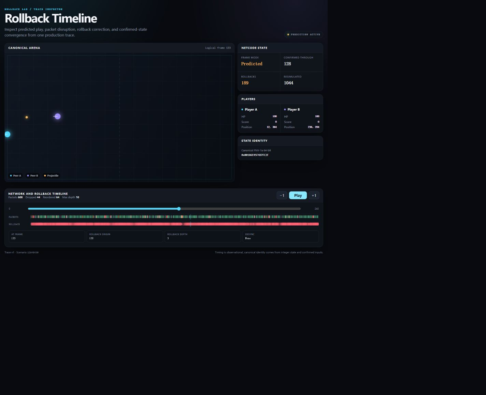

# Rollback Lab C++

Modern C++23 rollback netcode, reduced to a small deterministic arena and proven through both a seeded network emulator and real localhost UDP child processes.

```text
Fixed-Tick Simulation
    +
Local Input
    +
Predicted Remote Input
    +
Late Packet
    ↓
Restore Snapshot
    ↓
Resimulate
    ↓
Confirmed State Convergence
```

[](https://en.cppreference.com/w/cpp/23)
[](LICENSE)

## See the rollback



The checked-in [interactive viewer](viewer/sample-viewer.html) is a single HTML file with embedded CSS, JavaScript, and a bounded [production trace](viewer/sample-trace.json). Scrub frame by frame to inspect predicted state, confirmed boundaries, 189 rollback corrections, packet drops/reordering, projectiles, HP/score, hashes, and desync markers. It needs no CDN or Node runtime.

## Build and run

In a Visual Studio Developer PowerShell:

```powershell
cmake --workflow --preset msvc-debug-ci
```

Run the deterministic in-process network:

```powershell
build\msvc-debug\rollback_lab.exe simulate --scenario default --frames 240 --out artifacts\demo
```

Run the real relay + two-peer UDP demo:

```powershell
build\msvc-debug\rollback_lab.exe udp-demo --frames 120 --out artifacts\udp-demo
```

Other commands:

```text
rollback_lab replay <file>
rollback_lab verify [--frames N]
rollback_lab benchmark [--frames N]
rollback_lab compare <report-a> <report-b>
rollback_lab desync-demo [--out FILE]
```

## What is proved

- 60 tick/s-compatible canonical transition that accepts only frame + input pair.
- Integer state at 1/1,024-world-unit scale; checked 64-bit intermediate arithmetic; no canonical float, clock, OS state, or random device.
- Two move-only peer sessions with separate worlds, inputs, 256-slot snapshot/history rings, decisions, metrics, and hashes.
- Last-known remote-input prediction, no-op matching corrections, earliest-dirty rollback, and deterministic resimulation with a 120-frame fail-closed limit.
- PCG32 seeded latency, jitter, 0/1/5/20% loss, reordering, duplication, burst loss, queue/bandwidth limits, maximum age, and byte-stable repeated reports.
- Versioned field-by-field little-endian packets, 32-input redundancy, 1,200-byte bound, CRC-32/ISO-HDLC, 64-sequence receive window, exhaustive truncation tests, and a 100,000-input fuzz smoke.
- Versioned confirmed-input replay with checkpoint/final hash verification.
- Confirmed-only desync detection with a controlled frame-1 logic divergence and a minimal [diagnostic](samples/desync-diagnostic.json).
- Actual Winsock/BSD datagrams through an opaque relay and two independent peer processes, dynamic ports, watchdogs, symmetric completion, verified peer artifacts, and child reap.

The sample 240-frame run uses 5-tick latency, 3-tick jitter, 5% packet loss, 10% reorder, and 5% duplicate:

| Result | Value |
| --- | ---: |
| Sent / delivered / dropped packets | 608 / 594 / 44 |
| Duplicated / reordered packets | 30 / 64 |
| Rollbacks / resimulated frames / max depth | 189 / 1,044 / 10 |
| Confirmed boundary | 240 |
| Final hash A / B | `0x4B35DC3FD8F6009C` / `0x4B35DC3FD8F6009C` |
| Replay | verified |

Artifacts: [report JSON](samples/report.json), [binary replay](samples/input.rlr), [trace JSON](samples/trace.json), and [viewer](samples/viewer.html).

## Verification surface

The current suite has 43 focused behavior cases in the production-API runner plus a separate 100,000-input protocol fuzz smoke. PACT-70 adds the required 10,000-seed property run and final MSVC Debug/Release, Clang/GCC, sanitizer, clean-rebuild, replay, UDP, browser, and artifact evidence. Exact final counts and commands live in [TESTING.md](docs/TESTING.md) and the [verification matrix](tasks/20260903-215400-rollback-netcode-0.1/verification_matrix.md).

## Read the design

- [Architecture](docs/ARCHITECTURE.md)
- [Rollback algorithm](docs/ROLLBACK_ALGORITHM.md)
- [Determinism contract](docs/DETERMINISM_CONTRACT.md)
- [Binary protocol](docs/PROTOCOL.md)
- [UDP demo](docs/UDP_DEMO.md)
- [Replay format](docs/REPLAY_FORMAT.md)
- [Desync diagnosis](docs/DESYNC_DIAGNOSIS.md)
- [Code walkthrough](docs/CODE_WALKTHROUGH.md)
- [Interview guide](docs/INTERVIEW_GUIDE.md)
- [Live change drills](docs/LIVE_CHANGE_DRILLS.md)
- [Known limitations](docs/KNOWN_LIMITATIONS.md)
- [AI assistance](docs/AI_ASSISTANCE.md)

## Limits and authorship

This is an educational portfolio laboratory—not production networking, a commercial game, matchmaking, NAT traversal, encryption, authentication, anti-cheat, an engine integration, or a WAN readiness claim. CRC and FNV-1a are not security primitives. Timing is an observation and never part of canonical identity.

The user set the career goal, product direction, boundaries, deadline, and acceptance criteria. Codex GPT-5.6 Sol refined the architecture and produced the code, tests, protocol, UDP path, viewer, documentation, debugging, and packaging. The user did not hand-write delivery code in this session and should not present the project as independently hand-written. Before an interview, complete at least one [live change drill](docs/LIVE_CHANGE_DRILLS.md) personally.

Licensed under [MIT](LICENSE).

