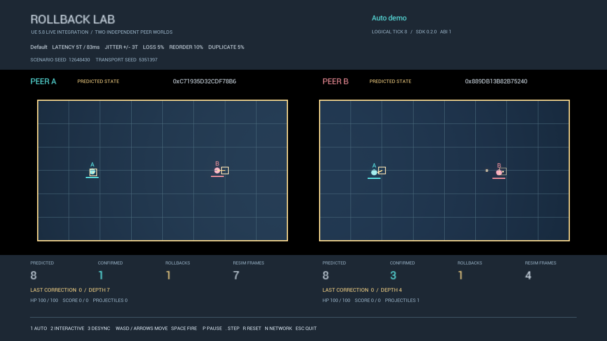
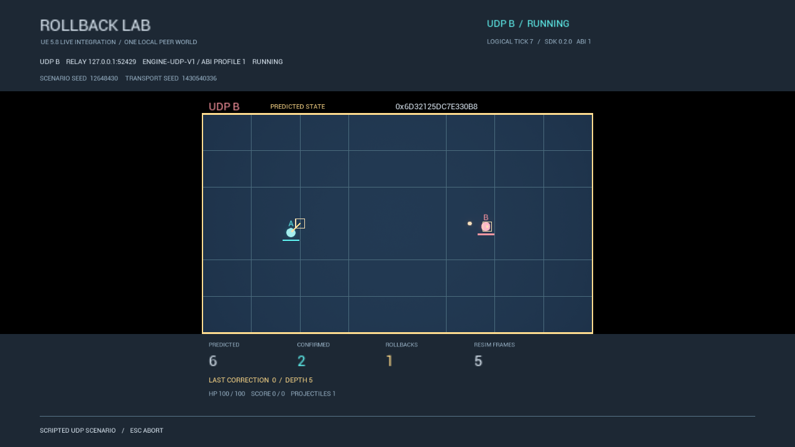

# RollbackLab 0.2.0 Candidate

A C++23 rollback laboratory embedded in Unreal Engine 5.8 through a stable C ABI. Two independent canonical peer worlds predict missing inputs, correct late mismatches, and converge. Inspect both views in one seeded demo, or run two separate Shipping clients through the real localhost UDP relay.

```text
C++23 Rollback Core
        ↓
Stable C ABI v1 SDK (DLL)
        ↓
UE 5.8 Runtime Plugin
        ↓
Two Independent Peer Worlds
        ↓
Visible Prediction / Correction / Convergence
        ↓
Packaged Hash-Parity Evidence
```

The final step is an acceptance gate: the CLI, C11 consumer and packaged UE executable must produce the same confirmed hash, report identity and replay. A clean P0 checkpoint passed BuildCookRun, controls, smoke, full regression and all 16 seeded three-way checks. The UDP extension now has two successful real relay + two-client runs with equal confirmed hashes and verified replays. All six UDP negative cases also pass; final clean-source rebuild/audit/PR acceptance are tracked in the [0.2 verification matrix](tasks/20260904-100800-ue5-live-integration-0.2/verification_matrix.md). This is a release candidate, with no release tag or published release.

## See the rollback



The UE image is a real **packaged Shipping preview** from the intermediate checkpoint. Final artifact proof comes from the verifier JSON. The native scene displays two canonical SDK worlds in one UE scene; Actors own presentation only. Ghosts, correction lines and flashes come from actual Core correction results.



The UDP preview is a real client capture. Each Shipping process owns one SDK session and displays both players from that session; remote inputs arrive through the third-process relay. It is a working-source checkpoint, not the final acceptance artifact.


Open the checked-in [interactive viewer](viewer/sample-viewer.html) to scrub predictions, confirmations, packet events, projectiles and corrections. It embeds a bounded [production trace](viewer/sample-trace.json) and needs no CDN or Node runtime.

## Shortest build and run

Run from the repository in PowerShell 7. Core requires CMake 3.28+, Ninja and a Visual Studio C++ Developer PowerShell; SDK scripts discover MSVC themselves. UE commands require a local, read-only UE 5.8 installation. Use a clean checkout for deliverable packages.

```powershell
# Core: configure, build and test.
cmake --workflow --preset msvc-debug-ci

# SDK: build, install, package, then verify independent C11/C++ consumers.
./scripts/BuildSdk.ps1
$revision = (git rev-parse HEAD).Substring(0, 12)
$Sdk = "artifacts/sdk/0.2.0-$revision/install"
./scripts/VerifySdk.ps1 -SdkRoot $Sdk

# Standalone Runtime plugin and cooked Win64 Shipping demo.
$EngineRoot = '<UE 5.8 root>'
$Plugin = "artifacts/ue5-0.2/plugin/0.2.0-$revision"
$Demo = "artifacts/ue5-0.2/demo/0.2.0-$revision-shipping"
./scripts/BuildUnrealPlugin.ps1 -EngineRoot $EngineRoot -SdkRoot $Sdk
./scripts/PackageUnrealDemo.ps1 -EngineRoot $EngineRoot -SdkRoot $Sdk

# Ordinary interactive packaged executable, then bounded automated smoke.
./scripts/LaunchPackagedUnrealArena.ps1 -EngineRoot $EngineRoot -DemoRoot $Demo
./scripts/LaunchPackagedUnrealArena.ps1 -EngineRoot $EngineRoot -DemoRoot $Demo -Smoke

# Use the run directory printed by the smoke command.
./scripts/VerifyUnrealIntegration.ps1 -SdkRoot $Sdk -PluginRoot $Plugin -DemoRoot $Demo -SmokeRun '<smoke run directory>'
```

Packaging generates the map and material automatically. SDK/DLL staging needs no manual copying. `-AllowDirty` produces diagnostic artifacts only; it cannot satisfy final acceptance. The verifier writes `artifacts/ue5-0.2/parity/<run>/verification.json`, which is the authority for the supplied artifacts' three-way parity and integrity checks.

After building the same-source SDK and Shipping demo, run the separate UDP clients:

```powershell
./scripts/RunUdpUnrealDemo.ps1 -EngineRoot $EngineRoot -SdkRoot $Sdk -DemoRoot $Demo -Case Normal
```

The supervisor allocates ports automatically, runs the existing relay and two Shipping inner executables, verifies one session per client, confirmed hashes and replay, and owns their shutdown. UDP is scripted and bounded to 240 frames; see [UE integration](docs/UE5_INTEGRATION.md) for profile and failure-case commands.

For the Editor and detailed prerequisites, see [UE integration](docs/UE5_INTEGRATION.md). Controls: **1** auto, **2** interactive, **3** controlled desync; **WASD/arrows** move A; **Space** attacks; **P** pauses; **.** steps one logical tick; **R** resets; **N** cycles Local/Default/Hostile network presets; **Esc** exits. Preset and mode changes restart the scenario.

The original CLI paths remain available:

```powershell
build\msvc-debug\rollback_lab.exe simulate --scenario default --frames 240 --out artifacts\demo
build\msvc-debug\rollback_lab.exe udp-demo --frames 120 --out artifacts\udp-demo
build\msvc-debug\rollback_lab.exe replay samples\input.rlr
```

## Evidence and identity

The preserved default sample uses scenario seed `12648430`, transport seed `5351397`, 240 frames, 5-tick latency, 3-tick jitter, 5% loss, 10% reorder, 5% duplicate and 1% burst loss.

| Observation | Preserved sample / verified Shipping checkpoint |
| --- | --- |
| Confirmed boundary A / B | 240 / 240 |
| Final hash A / B | `0x4B35DC3FD8F6009C` / `0x4B35DC3FD8F6009C` |
| Report identity | `0x8150FEDA020B66A8` |
| Rollbacks / resimulated frames / maximum depth | 189 / 857 / 9 |
| Replay | Canonical Replay v1 verifies; existing sample bytes are preserved |
| CLI / C API / UE Editor | Same sample hash and identity; [PACT-81](tasks/20260904-100800-ue5-live-integration-0.2/evidence/PACT-81.md), [PACT-83](tasks/20260904-100800-ue5-live-integration-0.2/evidence/PACT-83.md) |
| Packaged Shipping checkpoint | BuildCookRun, ordinary controls and rendered smoke passed; both owned processes exited |
| Seeded CLI / C API / packaged UE | 16/16 checks passed at the clean P0 checkpoint and again after UDP integration; complete reports/traces and replay bytes agree |
| Real relay + two Shipping clients | Two normal runs confirm 240 with the same canonical hash and equal peer replays; 153 and 141 aggregate rollbacks respectively. UDP report identities/counters are scheduling-dependent |

Checked artifacts: [report](samples/report.json), [replay](samples/input.rlr), [trace](samples/trace.json), [viewer](samples/viewer.html). A matching hash is evidence of agreement, not proof against collisions or every possible shared bug; replay reconstruction, golden samples, ownership tests and compiler checks provide additional constraints.

## What is tested

- **Core/CLI/UDP:** 61 behavior cases, preserving the original 56; integer state, tagged history, prediction/correction, strict packets, replay, bounded transport and real localhost relay + two peer child processes.
- **C ABI:** 26 exports, 7 session cases, 4 seeded live-driver cases and 6 UDP cases, plus a separate caught-allocation-failure regression. True C11 consumers and both 128-scenario C++/C parity sweeps remain. Installed `find_package` C11/C++ consumers pass separately, 2/2.
- **CTest:** 8 current entries, including fuzz, property and the isolated exception test. The UDP SDK checkpoint passed 7/7 in Debug, Release and ASan+UBSan before that final test was added; Release now passes 8/8. The earlier clean P0 five-configuration matrix and repeated 10,000 seeds passed. A fresh full matrix for the final UDP source remains required.
- **UE:** 32/32 Automation tests pass: the original 28 plus four UDP cases. The suite retains four real PIE lifecycles, actual held/short-tap movement/attack, exact step/reset and SDK resource cleanup. Six seeded Editor and Shipping process negatives passed. All six real UDP negative cases now pass, including the outer watchdog and confirmed desync; final clean-source verification remains required.

See [Core testing](docs/TESTING.md), [UE testing](docs/UE5_TESTING.md), and the [candidate notes](docs/RELEASE_NOTES_0.2_CANDIDATE.md) for scope, evidence and outstanding gates.

## Architecture and study guide

The canonical transition receives frame + input pair at a 60-tick/s-compatible cadence. State uses 1/1,024-world-unit integers and checked intermediates. Each peer owns its world, input history, 256-slot snapshots, decisions and metrics. Late mismatches restore the earliest dirty boundary and resimulate within a 120-frame fail-closed window. The UE bridge accumulates wall time outside Core and performs at most eight steps per callback.

- [Architecture](docs/ARCHITECTURE.md), [rollback algorithm](docs/ROLLBACK_ALGORITHM.md), [determinism](docs/DETERMINISM_CONTRACT.md)
- [C ABI](docs/C_ABI.md), [SDK packaging](docs/SDK_PACKAGING.md), [UE integration](docs/UE5_INTEGRATION.md)
- [Fixed-step adapter](docs/FIXED_STEP_ADAPTER.md), [presentation ownership](docs/ENGINE_PRESENTATION_BOUNDARY.md)
- [Protocol](docs/PROTOCOL.md), [UDP](docs/UDP_DEMO.md), [replay](docs/REPLAY_FORMAT.md), [desync diagnosis](docs/DESYNC_DIAGNOSIS.md)
- [Code walkthrough](docs/CODE_WALKTHROUGH.md), [interview guide](docs/INTERVIEW_GUIDE.md), [live change drills](docs/LIVE_CHANGE_DRILLS.md)

## Limits and AI assistance

This is an educational portfolio laboratory. The dual-view demo uses seeded packets in one process; the new scripted UDP mode uses two separate Shipping clients and the existing localhost relay. Successful normal UDP runs and all six negative cases are verified; final clean-source acceptance is still required. There is no UE Replication, Iris, production network service, WAN readiness, matchmaking, NAT traversal, authentication, encryption or anti-cheat claim. See [known limitations](docs/KNOWN_LIMITATIONS.md).

The user set the career goal, product direction, deadline, boundaries and acceptance criteria. **Codex GPT-5.6 Sol** refined the architecture and produced the Core/C ABI/SDK/UE implementation, tests, debugging, packaging, visual inspection and documentation. The user did not hand-write the delivered code in this session and must not describe it as independently hand-written. Before an interview, personally understand the ownership and rollback flow and complete at least one [exercise](docs/LIVE_CHANGE_DRILLS.md). Full disclosure: [AI assistance](docs/AI_ASSISTANCE.md).
